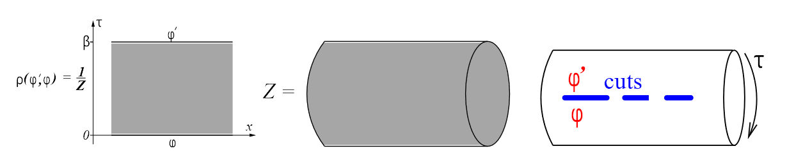
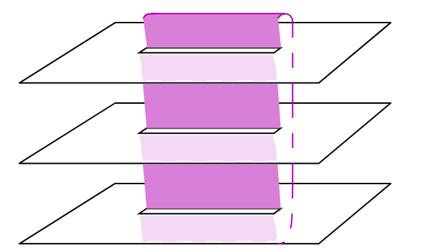

### 1. Entanglement Entropy
Let the Hilbert space of the system be a direct product:

$$
\mathcal{H} =\mathcal{H}_A\otimes \mathcal{H}_B,
$$

where $A$ and $B$ are two subsystems. The reduced density matrix of $A$ is $\rho_A=\mathrm{Tr}_B \rho$

The Entanglement Entropy(EE) we refer to is von Neumann entropy:
$$
S_A = \mathrm{Tr} \rho_A\ln \rho_A
$$

However, this quantity is hard to calculate directly. Here, we define nth the Rényi entropy:

$$
S^{(n)}_A = \frac{1}{1-n} \ln \mathrm{Tr} \rho_A^n.
$$

When taking the limit $n\to 1$, $S_A$ is recovered.

Here is a simple proof. Suppose that the reduced density matrix could be decomposed as $\rho_A = U\Lambda U^\dagger$, then
$$
\begin{aligned}
    \lim_{n\to1}S_A^{(n)}=&-\lim_{n\to1}\frac{1}{n-1}\ln \mathrm{Tr} \Lambda^n \\
    =&-\lim_{n\to1}\frac{\sum_i e^{n\ln \lambda_i}\ln \lambda_i}{\mathrm{Tr} \Lambda^n}\\
    =&-\sum_i\lambda_i \ln \lambda_i=S_A
\end{aligned}
$$

### 2. Path integral formulation

Now we want to calculate the Rényi entropy in path integral formulism. The first thing we should do is convert the reduced density matrix to path integral form.

Actually, we have met the form before. In statistical mechanics, the partition fucntion is $Z=\mathrm{Tr} e^{-\beta H}$, and the density matrix is $\rho=e^{-\beta H}/Z$. In path integral folmulation, 
$$Z=\int d\phi_0 d\phi_1..d\phi_N \exp\{-S\left[\phi\right ]\},$$
under the condition of $\phi_0=\phi_N$ for bosonic fields.
 This condition could be viewed as taking trace, as $\mathrm{Tr \hat{A}}=\sum_{i,j} \delta_{i,j}\langle i |\hat{A}|j \rangle$. 

 Thus, in the continuum limit, the density matrix could be expressed as:
 $$
 \begin{aligned}
     \rho_A(\{\phi_x\}|\{\phi^\prime _{x^\prime}\})=&Z^{-1}\int D\phi(y,\tau) \\
     &\prod_x \delta(\phi(y,0)-\phi^\prime _{x^\prime})\\
     &\prod_x \delta(\phi(y,\beta)-\phi_x)e^{-S_E},\\
 \end{aligned}
$$
 
where the states $\otimes |\{\phi_x\}\rangle = |\prod_x\{\phi_x\}\rangle$ form a basis.  

What about $\rho_A^n$? Comparing to the discrete version:

$$
\begin{aligned}
    \langle i_1 |\hat{A}^n|j_n\rangle=& \sum_{j_1;i_2,j_2...;i_n}\delta_{j_1,i_2}\delta_{j_2,i_3}..\delta_{j_{n-1},i_n}\\
    &\langle i_1 |\hat{A}|j_1\rangle\langle i_2 |\hat{A}|j_2\rangle...\langle i_n |\hat{A}|j_n\rangle,
\end{aligned}
$$

we find that the only trick is to "sewing" the boundary fields between each density matrix.  This trick is the so-called *replica trick*, i.e. make n copies of the reduced density matrix, label the fields by $1,2..., n$, then sew them along the boundary: $\phi_j(x,\beta^-)=\phi_{j+1}(x,0^+)$ where $n+1\equiv 1$, owing to the fact that we are taking the trace. 

The graph description of $\mathrm{Tr}\rho_A^3$ is shown below:

The connected manifold here is called Riemann surface $\mathcal{R}_{3,1}$, 3 means there are 3 sheets, 1 means there is only 1 cut. 

Formally, the $\mathrm{Tr}\rho_A^n$ is now expressed as:
 $$\mathrm{Tr}\rho_A^n=\frac{Z_n(A)}{Z^n}$$

### 3. CFT

Now we are going to use CFT to do the calculation. Specifically, we want to relate the $\mathrm{Tr}\rho_A^n$ to the expecation value of some primary fields in CFT. 

CFT has predicted the scaling behavior of that expectation value. So, after determining the scaling dimension of the operators, the Rényi entropy could be calculated directly, as well as the von Neumann entropy.

### 4. Twist fields

Now, suppose that we are dealing with free bosonic theory, in which only terms like $\phi^2$ and $(\partial \phi)^2$ exist. The action of $\mathcal{L}_n(\phi_1,\phi_2,...,\phi_n)$ is $\mathcal{L}(\phi_1)+\mathcal{L}(\phi_2)+...+\mathcal{L}(\phi_n)$. The difficulty in calculating the integral is the boundary condition $\phi_j(x,\beta^-)=\phi_{j+1}(x,0^+),\quad x\in [u,v]$. We will decouple the fields by Fourier transformation, with the cost of introducing the so-called "twist fields".

We note that there is a symmetry in the original theory: if we change the label of $\phi_j$ to $\phi_{j+1}$, the action stays unchanged. 

Now we define the twsit operators: 

$$
\begin{aligned}
T_n &\equiv T_\sigma, &\sigma:& i\to i+1\mod n\\
\tilde{T}_n &\equiv T_{\sigma^{-1}}, &\sigma^{-1}:& i\to i-1\mod n\\
\end{aligned}
$$

These operators encodes the boudary conditions, the partition function is proportional to $\langle T_n(u)\tilde{T}_n(v) \rangle_C$. The benefit is that, after introducing such a field, we could calculate the correlation function on a complex plane.

Further, if an operator $O(x,\tau;i)$ is defined on the $i^{th}$ sheet, the correlation function is:

$$
\langle  O(x,\tau;i)\rangle_{\mathcal{R}_{n,1}}=\frac{\langle T_n(u)\tilde{T}_n(v)O_i(x,\tau)\rangle_C}{\langle T_n(u)\tilde{T}_n(v) \rangle_C}
$$

$O_i(x,\tau)$ is the field coming from the $i^{th}$ copy of the original theory.

You may not sure why the operators coudl be viewed as "fields", I will give a brief explanation below.

### 5. Clarifying the role of twist operators

Considering the Fourier transform:

$$
\tilde{\phi}_k = \sum_{j=1}^n e^{2\pi i \frac{k}{n}j}\phi_j, \quad k=0,1...,n-1.
$$

The original action is now

$$
\mathcal{L}=\mathcal{L}(\tilde{\phi}_1)+\mathcal{L}(\tilde{\phi}_2)+...+\mathcal{L}(\tilde{\phi}_n).
$$

It seems to be unchanged under this transformation. Let's look at the boundary condition. 

$$
\begin{aligned}
\tilde{\phi}_k(x,\beta^-) =& \sum_{j=1}^n e^{2\pi i \frac{k}{n}j}\phi_j(x,\beta^-)\\
=&\sum_{j=1}^n e^{2\pi i \frac{k}{n}j}\phi_{j+1}(x,0^+)\\
=&e^{-2\pi i \frac{k}{n}}\sum_{j=1}^n e^{2\pi i \frac{k}{n}(j+1)}\phi_{j+1}(x,0^+)\\
=&e^{-2\pi i \frac{k}{n}}\tilde{\phi}_k(x,0^+)
\end{aligned}
$$

This phase factor could be viewed as the conribution from a gauge field at the point $(u,0)$. There is another gauge field at $(v,0)$ which contributes a phase factor of $e^{2\pi i \frac{k}{n}}$.

By gauge tranformation, terms like $\bar{\phi}\gamma^\mu iA_\mu \phi$ appear in the action. Finally, the partition function could be written as:

$$
\begin{aligned}
Z_n=&\prod_{k=1}^n Z_k\\
Z_k=&\langle e^{i\int A^k_\mu j^\mu_kd^2x}\rangle 
\end{aligned}
$$

Twist operators is diagonal under the $\{\tilde{\phi_k}\}$ basis. Thus we could write $T_n=T_{n,1}T_{n,2}...T_{n,n}$, and 

$$
\begin{aligned}
    T_{n,k}\tilde{\phi}_k =& e^{2\pi ik/n}\tilde{\phi}_k\\
    T_{n,k}\tilde{\phi}_{k^\prime} =& \tilde{\phi}_{k^\prime}\\
\end{aligned}
$$

In this decomposition, $Z_k$ could be written as $\langle T_{n,k}(u,0) \tilde{T}_{n,k}(v,0) \rangle$. Now, we could use CFT to predcit the scaling of this expecation value.

It's important to clarify the monifold we are dealing with. Before introducing twsit fields, we are doing integration on Riemann surface, after decoupling the fields with twsit fields, each $Z_k$ is on its own complex plane. 

### 6. Calculation in CFT

There is 